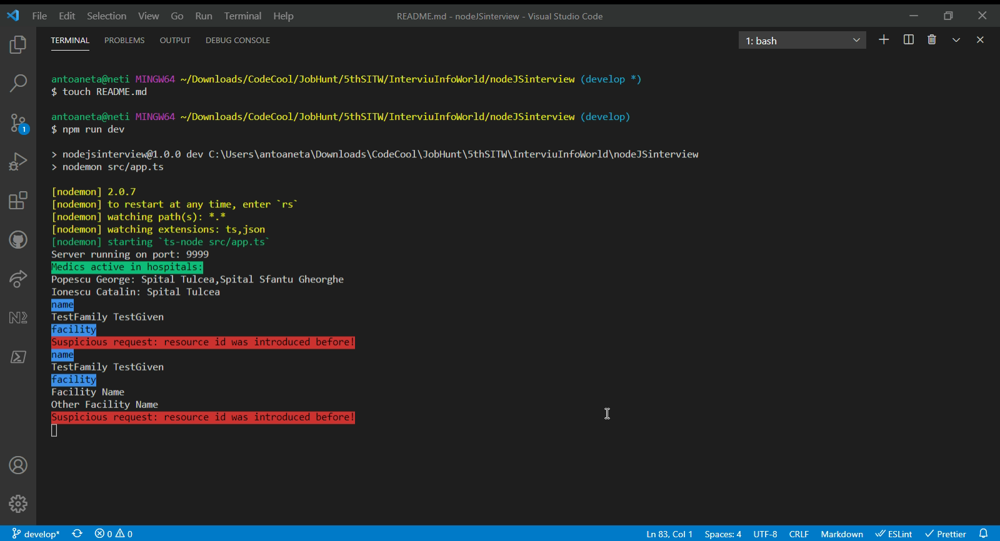
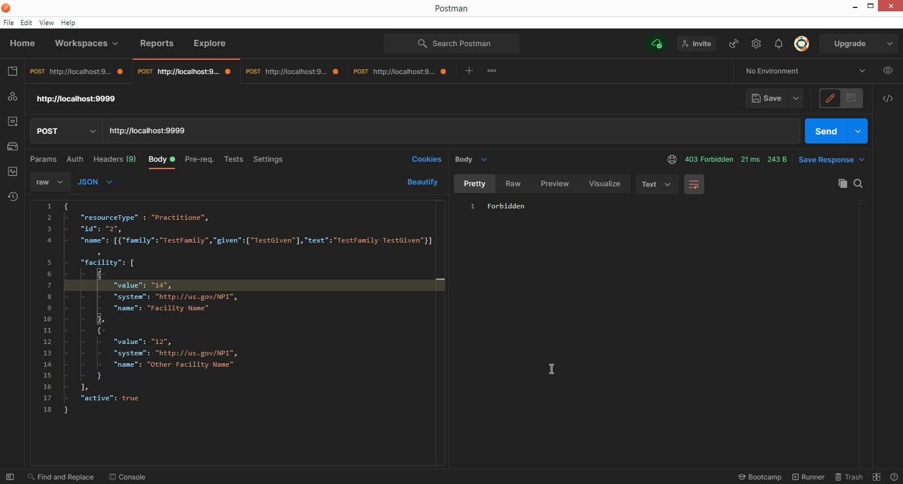

# Interview NodeJS project

This is part of the interview projects requested by client from Codecool's JobHunt Module.

## Description

A NodeJS endpoint listening for specific requests.
Client requirements is located in "interviu_nodeJS.docx" file.
Deadline was in several days.

## Technologies used

Node.JS, TypeScript, Postman.

This project was created with [Visual Studio Code](https://code.visualstudio.com/).

## Installation

After downloading the repo, open the project with VSCode and run:

```node.js
npm install
```

### Starting the solution

1. In order to start the server, run in terminal:

```js
npm run dev
```

2. Atferwards, open Postman and add a new header for all POST requests with the key:

```js
x - vamf - jwt;
```

and the value: `Bearer` followed by space and a Base64 encoding for the following format or similar:

```js
{
  "authenticated": true,
  "iss": "JWT Builder",
  "facility": ["12", "13"],
  "roles": ["Admin"]
}
```

3. Then, in the Postman body of the POST request, add either:
   - paste raw JSON payload with the following format or similar:

```js
    {
        "resourceType" : "Practitioner",
        "id": "1",
        "name": [{"family":"TestFamily","given":["TestGiven"],"text":"TestFamily TestGiven"}],
        "facility": [
            {
                "value": "1",
                "system": "http://us.gov/NPI",
                "name": "Facility Name"
            },
            {
                "value": "2",
                "system": "http://us.gov/NPI",
                "name": "Other Facility Name"
            }
        ],
        "active": true
    }
```

- or add a CSV file with the key: `file` and the format similar to:

```js
ID, FamilyName, GivenName, FacilityId, SystemId, NameId, Active
1, Popescu, George, 12, http://ro.gov/NPI, Spital Tulcea, true
1, Popescu, George, 13, http://ro.gov/NPI, Spital Sfantu Gheorghe, true
1, Popescu, George, 13, http://ro.gov/NPI, Spital Constanta, false
2, Ionescu, Catalin, 12, http://ro.gov/NPI, Spital Tulcea, true
```

## Implementation

VSCode:

Postman:

